# 🧍‍♂️Personal Project

#### [목차]

[웹 앱 예약서비스 시스템](#웹-앱-예약서비스-시스템)

[프로젝트 환경](#프로젝트-환경)

[기술 스택](#기술-스택)

[DB 설계](#DB-설계)

[프로젝트 수행 역할 및 기능](#프로젝트-수행-역할-및-기능)

[프로젝트 회고](#프로젝트-회고)

# 웹 앱 예약서비스 시스템

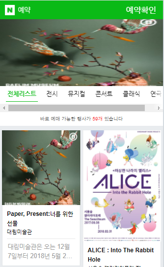

실제 N사 기업의 웹 서비스에서 사용됐던 예약서비스 관리 시스템을 구현했다.

요즘에는 영화 예매, 항공권 예매 등을 웹이나 앱을 통한 예약서비스를 많이 이용한다. 이용만 하던 예약 서비스를 직접 구현해보면서 어떻게 예약서비스 시스템이 이루어지고 고객들에게 서비스가 제공되어지는지 궁금증을 해소하고자 프로젝트를 진행하게 되었다.

크게 3가지 서비스 기능을 구현했다. 

- **메인페이지**
- 각 항목의 **상세페이지**
- **예약하기**

# 프로젝트 환경

- **OS :** Windows

- **IDE :** Eclipse , Version  2019-12 (4.14.0)

- **JDK :** openjdk version "13.0.1"

- **Server :** Apache Tomcat v8.5

- **DB :** MySQL version 5.7

# 기술 스택

- **Programming Language :** java
- **DBMS** : MySQL
- **Front-end** : HTML5 & CSS3, javascript , jQuery   
- **Back-end**: JSP, Spring , Spring JDBC

# DB 설계

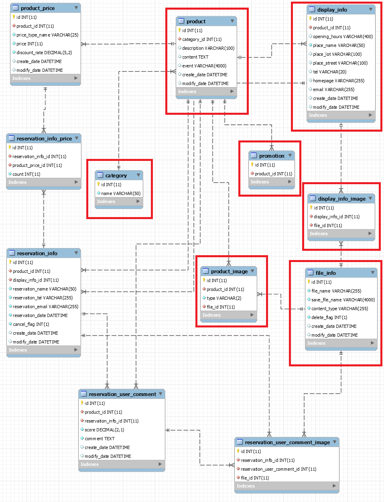

# 프로젝트 수행 역할 및 기능

> ### 무한 슬라이더

- 진행중인 프로모션 상품들을 오른쪽에서 왼쪽으로 자동으로 일정 간격에 맞춰서 무한슬라이더 됨
-  **`window.requestAnimationFrame`**
  -  화면에 새로운 애니메이션을 업데이트 할 때 마다 requestAnimationFrame 메소드 호출해서 구현

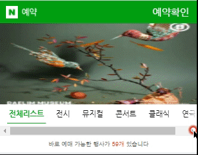

> ### 탭 UI

- 고객들에게 새로고침 없이 더 나은 UX를 제공하기 위해 비동기 통신으로  탭 UI 구현
  - javascript Ajax 사용
  - 각 분야별로 제공되는 행사 수도 같이 갱신 됨
  - 행사 상품은 4개씩 보여짐

> ### 더보기

- 더보기를 누르면 추가 데이터를 가져와서 그 결과가 화면에 노출됨
  -  4개씩 추가
  - 추가로 보여줄 데이터가 없으면 더보기버튼은 사라짐

> ### 상세페이지

- 상세페이지 이동
  - 해당 상세페이지 URL 경로에 전시상품번호를 추가해줌

> ### 펼쳐보기

- 길게 작성된 상품에 대한 내용을 펼쳐보기/접기를 통하여 볼 수 있음

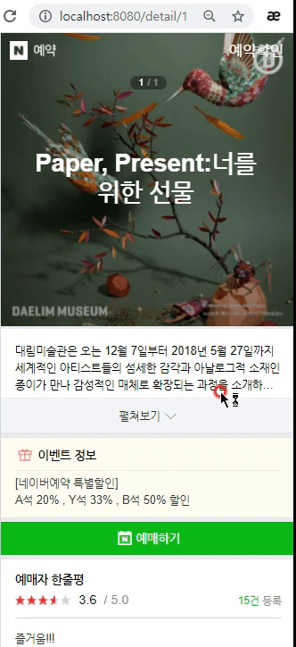

> ### 한줄평 보기

- 고객들이 작성한 예매자 한줄평을 볼 수 있음
  - 평점을 백분율로 환산해서 별점 나타냄

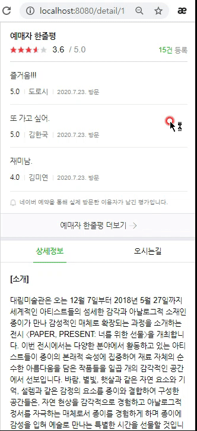

> ### 오시는길 , 상세정보

- 전시상품의 상세정보와 오시는길의 데이터를 가져와서 제공됨

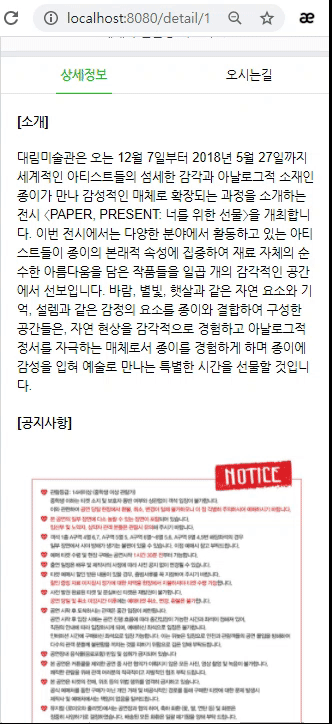

> ### 예약페이지 티켓 수량 선택

- 예약하기전 예약하고자 하는 티켓 수량을 +,-로 조절할 수 있음
  - 티켓 수량이 0이면 -버튼은 활성화가 안됨
- 예매자 정보에 있는 예매내용에서 총 티켓 수량을 확인할 수 있음

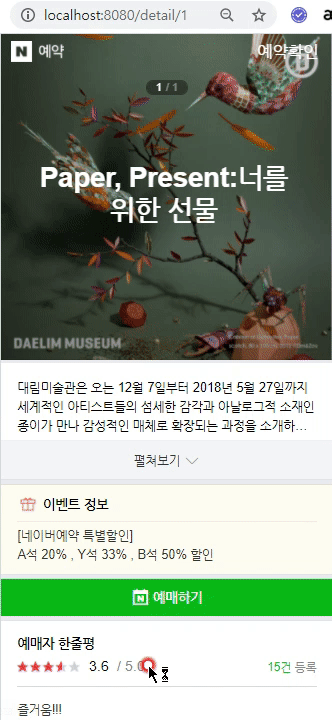

> ### 예매자 정보

- 예매자 이름, 연락처, 이메일 입력
  - 정규식을 사용하여 형식이 틀리면 입력란 아래에 오류표시 노출시킴

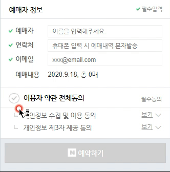

> ### 이용자 약관 동의 후 예약하기

- 이용자 약관 전체동의를 선택해야 예약할 수 있음
- 이용자 약관 전체동의 활성화 조건
  - 티켓 수량이 총 1매 이상
  - 예매자 정보들이 필수 입력 되어야함
  - 위의 조건들이 하나라도 지켜지지 않을시 약관 동의가 활성화 되지 않음

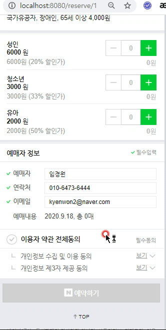

# 프로젝트 회고

### 😮 느낀점

- Spring 의 강점을 느낄 수 있었음

  - IOC Container가 대신 Bean객체를 생성,관리하고 의존성을 대신 주입해줌으로써 코드의 재사용과 유지보수 하기가 용이했음

  - Spring JDBC를 통한 ConnectionPool을 쉽게 사용할 수 있고, 간결한 API로 반복적인 쿼리 작업등을 대신 할 수 있었음

  - @Controller, @Service,@Repository 등의 다양한 어노테이션을 활용하여 각각의 클래스가 어떤 용도로 쓰이는지 직관적으로 확인할 수 있고, 용도에 맞게 로직을 구현할 수 있음

- 선배 개발자분들께 코드리뷰를 받으면서 클린 코드 작성방법과 더 좋은 방식의 코드 구현을 조언받으면서 코드 퀄리티를 높일 수 있었음 -> 코드 리뷰의 중요성을 깨달음

  - 실제 코드 리뷰 받은 예시)

  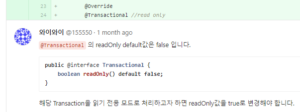

  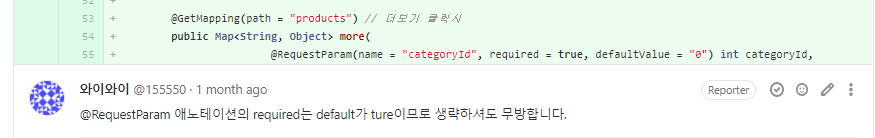

### 😢 아쉬운 점&개선할 점

- 테스트 코드를 작성해볼 것
- 예약 확인, 회원가입 등 필요한 기능과 컨텐츠를 더 확장해나가면서 프로젝트를 완성해 나가볼 것

- 더 좋은 코드를 위한 리팩토링 방법과 Spirng 에 대한 이해와 더 효율적으로 구현할 수 있는 방법에 대해서 공부해 볼 필요가 있겠다.

[⬆ 위로](#)

